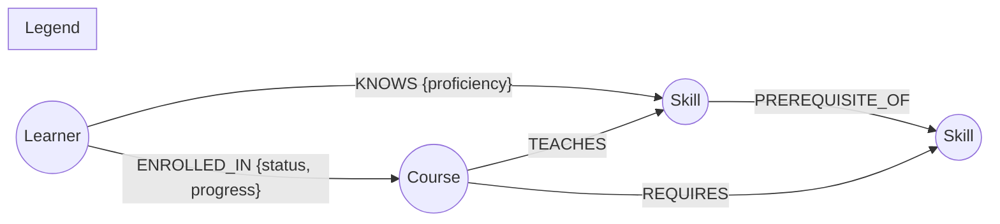

# Waypoint

A trail map for the skills you're building. Waypoint is a small learning-platform
app: it models skills, courses, and learners as a graph, and lets a learner pick
a target skill and get back a concrete route — the prerequisite skills they're
missing, in order, with a course suggested for each gap.

Built on **CognoDB** (openCypher over Bolt) via the official `neo4j-driver`.

## Why a graph database?

The core question this app answers — *"given what I already know, what's the
shortest path to skill X, and what should I learn next to unlock the most
future options?"* — is a traversal question, not a row-lookup question.

In a relational schema, `PREREQUISITE_OF` would live in a self-referencing
`skill_prerequisites` table. Answering "what's the full prerequisite chain
for System Design?" or "what's the shortest path from what Amina knows to
Kubernetes?" then means a **recursive CTE** with a variable, unknown depth —
and you need a *different* recursive query for every hop count, plus careful
cycle protection. The "what should I learn next" recommendation is worse: for
every candidate skill you'd need to check that *all* of its prerequisites are
satisfied (a set-containment check per row) and separately count everything
reachable downstream (another recursive CTE), then join the two. That's a lot
of SQL to express "look one step out, then look several steps out."

In Cypher, the same three questions are each a single, readable pattern:

- Prerequisite chain: `(root)<-[:PREREQUISITE_OF*1..6]-(ancestor)`
- Shortest route: `(start)-[:PREREQUISITE_OF*0..6]->(target)`, ordered by
  path length
- "Ready to learn": a pattern comprehension checking every direct
  prerequisite is known, ranked by a downstream reachability count

None of these need the traversal depth fixed in advance, none need manual
cycle handling, and all of them read like the question they answer. That's
the whole case for a graph database here: the *relationships* (what unlocks
what) are the primary thing being queried, not an afterthought joined in at
the end.

## Data model



**Nodes**

| Label     | Key properties                                  |
|-----------|--------------------------------------------------|
| `Skill`   | `id`, `name`, `category`                          |
| `Course`  | `id`, `title`, `provider`, `level`, `durationHours` |
| `Learner` | `id`, `name`, `role`                               |

**Relationships**

| Type              | Direction              | Properties                | Meaning                              |
|-------------------|-------------------------|----------------------------|----------------------------------------|
| `PREREQUISITE_OF` | `Skill -> Skill`         | —                          | source must be learned before target  |
| `TEACHES`         | `Course -> Skill`        | —                          | completing the course grants the skill |
| `REQUIRES`        | `Course -> Skill`        | —                          | the course assumes this skill already |
| `KNOWS`           | `Learner -> Skill`       | `proficiency`              | learner already has this skill        |
| `ENROLLED_IN`      | `Learner -> Course`      | `status`, `progress`       | learner's course progress             |

The seed dataset (`backend/seed/data.js`) has 33 skills across six
categories (Foundations, Frontend, Backend, Data, ML, DevOps, Architecture),
34 courses, 12 learners, and their relationships — comfortably inside the
CognoDB free-tier (c0) limits.

## The main queries

All queries are parameterised (no string-concatenated Cypher) and live in
`backend/src/routes/`.

1. **Full prerequisite tree** (`GET /api/skills/:id/prerequisites`) —
   variable-length traversal *up to 6 hops* to find every ancestor skill of a
   target, with its depth. One line replaces a recursive CTE.

   ```cypher
   MATCH path = (root:Skill {id: $id})<-[:PREREQUISITE_OF*1..6]-(ancestor:Skill)
   RETURN ancestor.id, ancestor.name, ancestor.category, length(path) AS depth
   ```

2. **Route planning** (`GET /api/route?learnerId=&targetSkillId=`) — the
   headline multi-hop query. Finds the *shortest* prerequisite path from
   something the learner already knows (or a root skill) to the target, then
   attaches up to two course options per step.

3. **"What should I learn next"** (`GET /api/learners/:id/recommend`) — a
   skill qualifies when every one of its direct prerequisites is already
   known but the skill itself isn't. Candidates are ranked by how many
   further skills they transitively unlock, using a pattern comprehension
   plus a variable-length downstream count.

4. **Fellow hikers** (`GET /api/learners/:id/peers`) — a 2-hop
   `Learner-KNOWS->Skill<-KNOWS-Learner` traversal with an overlap count.
   In SQL this is a self-join on a bridge table with a `GROUP BY`/`HAVING`;
   here it's one pattern.

5. **Trail map** (`GET /api/graph`) — the full skill graph (nodes + edges)
   powering the force-directed visualization on the homepage.

## Project structure

```
waypoint/
├── backend/
│   ├── src/
│   │   ├── server.js       # Express app, static frontend, error handling
│   │   ├── db.js           # CognoDB driver, connection check, query helpers
│   │   ├── serialize.js    # Neo4j record -> plain JSON conversion
│   │   └── routes/         # skills, courses, learners (+ the 5 queries above)
│   ├── seed/
│   │   ├── data.js         # sample skills / courses / learners
│   │   └── seed.js         # idempotent loader (MERGE, safe to re-run)
│   └── .env.example
└── frontend/
    └── public/              # static HTML/CSS/JS, no build step
        ├── index.html
        ├── styles.css
        └── app.js           # fetches the API, renders the D3 trail map
```

The frontend is plain HTML/CSS/JS (D3 loaded from a CDN for the force-directed
graph) rather than a framework, so the whole app is one Node service with no
separate build or hosting step — Express serves `frontend/public` directly.

## Setup

### 1. Create a CognoDB instance

1. Sign up at [console.cognodb.com](https://console.cognodb.com/signup) (free
   tier, no card).
2. Create a free (**c0**) instance and pick a region — it provisions in under
   a minute.
3. Copy the connection URI (`bolt+s://<instance-id>.databases.cognodb.cloud`)
   and the generated password for the `cognodb` user. **The password is shown
   once** — save it now.

### 2. Configure and seed the backend

```bash
cd backend
npm install
cp .env.example .env
# edit .env with your COGNODB_URI and COGNODB_PASSWORD
npm run seed
```

The seed script wipes any prior Waypoint data and reloads it, so it's safe to
re-run.

### 3. Run the app

```bash
npm start
```

Open `http://localhost:4000`. The API and the frontend are served from the
same origin, so nothing else needs to run.

### 4. Deploying

Any free Node hosting tier works (Render, Railway, Fly.io, etc.) since it's a
single service:

- Build command: `npm install` (run inside `backend/`)
- Start command: `npm start`
- Environment variables: `COGNODB_URI`, `COGNODB_USER`, `COGNODB_PASSWORD`

## Engineering notes

- **No secrets committed.** Connection details are read from environment
  variables (`backend/.env`, gitignored); `.env.example` documents the shape.
- **Every query is parameterised** through the driver (`$param` placeholders)
  — no string-built Cypher anywhere in the codebase.
- **Graceful failure.** If CognoDB is unreachable, `db.js` logs it clearly at
  boot, `/api/health` reports `503`, and every other route returns a friendly
  JSON error instead of a raw driver stack trace. The frontend surfaces this
  as a "trail conditions: database unreachable" banner rather than a blank
  page.

## Screenshots

_See `screenshots/` — trail map, route planner, and learner profile views._
